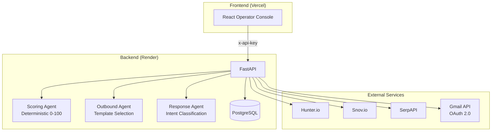

# Adina — Forward-Deployed AI SDR Agent

An operator-facing system that automates B2B lead discovery, qualification, and outreach for growth-stage companies. Built as a full-stack application with deterministic AI agents — no black-box LLMs in the scoring or drafting pipeline.

## Why this exists

Most AI SDR tools are black boxes that send emails autonomously with no operator oversight. Founders at growth-stage companies need outreach that scales, but they also need to understand *why* a lead was qualified and *what* will be sent before it goes out.

Adina gives operators a transparent pipeline: discover leads from multiple sources, score them against explicit criteria (with visible reasoning), review AI-drafted emails, and send through their own Gmail — all with a hard daily cap and approval gates. Every decision the system makes is auditable.

## Architecture



**Workflow:** Discover leads (SerpAPI/Hunter/CSV upload) → Score against knowledge pack → Draft outreach email → Operator reviews and approves → Send via Gmail (100/day cap) → Classify replies by intent → Suggest follow-up.

## Repository structure

```
adina-bot/
├── backend/             # FastAPI, SQLAlchemy, deterministic AI agents
│   ├── app/
│   │   ├── main.py      # 35+ endpoints, auth middleware, CORS
│   │   ├── agent/       # Scoring, outbound drafting, reply classification
│   │   ├── models.py    # Lead, SentEmail, DailyEmailCount, DiscoveryCache
│   │   └── gmail.py     # OAuth 2.0 integration
│   └── services/        # Hunter, Snov, SerpAPI, Google CSE clients
├── frontend/            # Vite + React + TypeScript + Tailwind
│   └── src/
│       ├── pages/       # Leads, Inbox, Sent, Settings, Demo
│       └── api/         # Axios client with x-api-key interceptor
├── scripts/             # Smoke tests
└── materials/           # Sales playbooks
```

| Document | Description |
|----------|-------------|
| [backend/README.md](backend/README.md) | Backend setup, API reference, agent details |
| [frontend/README.md](frontend/README.md) | Frontend setup, component architecture |
| [RESUME_ADINA.md](RESUME_ADINA.md) | Quick-start guide, env vars, troubleshooting |

## Security & design tradeoffs

**API key model, not JWT.** The operator console authenticates via a shared `x-api-key` header. This is a deliberate choice: Adina is an internal operations tool, not a multi-tenant SaaS. A single API key shared between the frontend and backend is the simplest model that provides access control without session management overhead. The key is injected at build time on Vercel and validated by middleware on every `/api/*` request.

**Tradeoffs I'm aware of:**
- No per-user auth or RBAC. Acceptable for a single-operator deployment; would need to change for team use.
- API key in client bundle is visible in browser devtools. Mitigated by the tool being internal — if this were customer-facing, I'd move to server-side sessions or OAuth.
- `DISABLE_API_KEY_AUTH` exists for local dev. It's explicitly blocked from production via documentation, not enforcement. In a real deployment, I'd add an environment check.

**Deterministic agents, not LLM calls.** Scoring uses a transparent point system (industry match, employee count, stage, etc.) rather than GPT-style inference. This means the operator can predict and explain every score. The tradeoff is lower flexibility — edge cases that a language model might catch are missed. For an outbound tool where false positives cost real reputation, predictability wins.

**Gmail daily cap (100 emails).** Hard-coded in the backend, not configurable via UI. Protects the operator's domain reputation and stays well under Gmail's sending limits. A customer deployment would make this configurable per-domain.

## Security posture & boundaries

**Current scope:** Single-tenant pilot tool operated by the deployer. This is not a production SaaS — there is no multi-user auth, no audit log, and the API key is a shared secret. The security controls below are appropriate for this scope and are documented honestly.

**Automated checks (GitHub Actions):**
- **Secret scanning** — [gitleaks](https://github.com/gitleaks/gitleaks) runs on every push and PR to catch accidentally committed credentials.
- **Python CVE scan** — `pip-audit` checks `backend/requirements.txt` against known vulnerability databases.
- **Python static analysis** — `bandit` scans `backend/app/` for common security anti-patterns (hardcoded passwords, insecure deserialization, etc.).
- **Frontend dependency audit** — `npm audit` flags high-severity vulnerabilities in `frontend/` dependencies.
- **CodeQL** — GitHub's semantic analysis runs weekly and on every PR for both Python and JavaScript/TypeScript.
- **Dependabot** — Automated PRs for dependency updates (pip, npm, GitHub Actions) on a weekly cadence.

**Outbound action safeguards:**
- All emails require explicit operator approval before sending.
- Hard daily cap of 100 emails enforced server-side.
- Demo mode (`DEMO_MODE=true`) blocks all real sends entirely.

**What this repo does NOT claim:**
- Production-grade multi-tenant security.
- SOC 2 or equivalent compliance.
- Protection against a compromised deployment environment.

**Production hardening path:** SSO/OAuth with per-user sessions → RBAC (operator vs. viewer) → structured audit logs → per-tenant data isolation → rate limiting per API key → environment-enforced `DISABLE_API_KEY_AUTH` block → secret rotation policy.

For the full threat model and detailed security documentation, see [docs/security.md](docs/security.md).

## What I'd do next in a customer deployment

- **Per-tenant isolation.** Move from shared API key to OAuth + org-scoped data. Each customer gets their own knowledge pack and scoring criteria.
- **Webhook-driven reply ingestion.** Currently reply classification is manual. A Gmail push notification or Pub/Sub integration would make the inbox reactive.
- **LLM-assisted drafting with guardrails.** Swap the template-based outbound agent for a language model with structured output constraints. Keep the deterministic scorer — add LLM creativity only where hallucination risk is bounded.
- **Observability.** Structured logging, OpenTelemetry traces across the discovery → score → draft → send pipeline. Critical for debugging at scale.
- **Email warm-up and rotation.** Production outbound needs gradual domain warm-up and multi-mailbox rotation to maintain deliverability.
- **CI/CD and staging environment.** The current deploy is direct-to-prod on both Render and Vercel. A staging environment with integration tests against mocked external services would catch regressions before they hit production.
